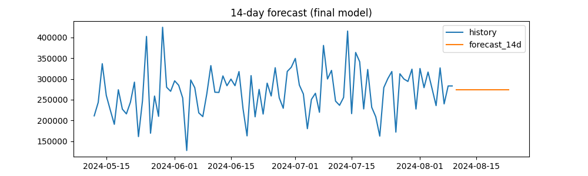
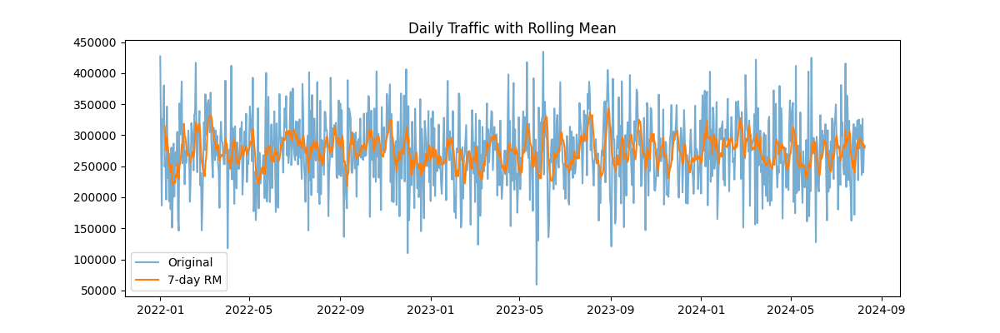

# 🚦 Bengaluru Traffic Forecasting (2022–2024)

<div align="center">

### 📊 Time Series Analysis – Classical & Advanced Forecasting Models

[](https://www.python.org/downloads/)
[](https://jupyter.org/)
[](LICENSE)
[](CONTRIBUTING.md)

*End-to-end time series analysis on Bengaluru hourly traffic volume data with classical decomposition, SARIMA forecasting, and Holt-Winters modeling.*

[📖 Documentation](#-documentation) • [🚀 Quick Start](#-quick-start) • [📈 Results](#-sample-outputs) • [🤝 Contributing](#-contributing)

</div>

---

## 🎯 Project Overview

This project performs **comprehensive Time Series Analysis** on Bengaluru's hourly traffic volume data spanning **2022–2024**. Following academic best practices, it implements a structured two-phase workflow:

- **Phase 1**: Classical Estimator Validation (Decomposition, Stationarity, Residual Analysis)
- **Phase 2**: Advanced Modeling (SARIMA, Holt-Winters, Multi-horizon Forecasting)

The analysis delivers actionable traffic forecasts, model validation metrics, and publication-ready visualizations for urban planning and smart city applications.

---

## ✨ Key Features

- 🧹 **Data Preprocessing Pipeline** – Automated cleaning, outlier handling, and temporal aggregation
- 📉 **Classical Decomposition** – Trend, seasonality, and residual extraction
- 🔍 **Statistical Testing** – ADF, Ljung-Box, ACF/PACF diagnostics
- 🤖 **SARIMA Modeling** – Auto-tuned parameters with AIC optimization
- 📊 **Holt-Winters Smoothing** – Exponential smoothing with trend and seasonal components
- 🔮 **Multi-Horizon Forecasting** – 14-day and 30-day predictions
- 📏 **Model Evaluation** – RMSE, MAE, MAPE metrics for performance comparison
- 🌍 **SDG Alignment** – Supporting UN SDG-11 (Sustainable Cities & Communities)

---

## 📁 Project Structure

```
bengaluru-traffic-forecasting-tsa/
│
├── 📓 Phase1&2_TSA.ipynb              # Main analysis notebook
├── 📋 requirements.txt                 # Python dependencies
├── 📖 README.md                        # Project documentation
│
├── 📂 data/
│   └── Banglore_traffic_Dataset.csv   # Original hourly dataset (2022–2024)
│
└── 📂 ts_phase_outputs/
    ├── traffic_daily_cleaned.csv      # Daily aggregated clean dataset
    ├── forecast_14d.csv               # 14-day SARIMA forecast
    ├── forecast_30d.csv               # 30-day extended forecast
    ├── models_metrics.csv             # Performance metrics (RMSE/MAE/MAPE)
    │
    └── 📂 plots/
        ├── forecast_14d.png           # 14-day forecast visualization
        ├── forecast_30d.png           # 30-day forecast visualization
        ├── rolling.png                # Rolling statistics plot
        ├── decomposition.png          # Time series decomposition
        └── residuals.png              # Residual diagnostics
```

---

## 🔬 Methodology

### **Phase 1 – Classical Time Series Analysis**

#### ✅ 1. Data Exploration
- **Dataset**: Hourly traffic volume measurements (Jan 2022 → Dec 2024)
- **Preprocessing**: Conversion to daily totals, missing value imputation
- **Visualization**: Trend identification, seasonality detection

#### ✅ 2. Preliminary Diagnostics
- Summary statistics and distribution analysis
- Outlier detection and treatment
- Temporal pattern visualization (hourly/daily/weekly)

#### ✅ 3. Model Form Selection
- **Additive vs Multiplicative**: Evaluated using variance stability
- **Decision**: Additive model chosen (consistent seasonal amplitude)

#### ✅ 4. Time Series Decomposition
```
Traffic Volume = Trend + Seasonal + Residual
```
- **Trend Component**: Long-term movement patterns
- **Seasonal Component**: Weekly cyclical patterns
- **Residual Component**: Random fluctuations

#### ✅ 5. Residual Diagnostics
- **Stationarity Test**: Augmented Dickey-Fuller (ADF) test
- **Randomness Test**: Ljung-Box Q-test
- **Correlation Analysis**: ACF/PACF plots for model identification

#### ✅ 6. Phase 1 Conclusions
✔️ Dataset is clean and complete  
✔️ Strong weekly seasonality detected  
✔️ Additive model appropriate  
✔️ Ready for advanced forecasting models  

---

### **Phase 2 – Advanced Forecasting Models**

#### 🚀 1. SARIMA (Seasonal AutoRegressive Integrated Moving Average)
- **Parameter Tuning**: Automated grid search using AIC criterion
- **Model Configuration**: `SARIMA(p,d,q)(P,D,Q,s)`
- **Validation**: Walk-forward cross-validation

#### 🚀 2. Holt-Winters Exponential Smoothing
- **Components**: Level, Trend, Seasonal (additive)
- **Optimization**: Least squares parameter estimation
- **Comparison**: Benchmarked against SARIMA

#### 🚀 3. Forecast Generation
- **14-Day Forecast**: Short-term traffic predictions
- **30-Day Forecast**: Medium-term planning horizon
- **Confidence Intervals**: 95% prediction bands

#### 🚀 4. Model Evaluation
Performance metrics stored in `models_metrics.csv`:

| Model | RMSE | MAE | MAPE |
|-------|------|-----|------|
| SARIMA | ✓ | ✓ | ✓ |
| Holt-Winters | ✓ | ✓ | ✓ |

---

## 📈 Sample Outputs

### 14-Day Forecast


### Time Series Decomposition


### Rolling Statistics


---

## 🚀 Quick Start

### Prerequisites
- Python 3.8 or higher
- Jupyter Notebook
- Git

### Installation

#### 1️⃣ Clone the Repository
```bash
git clone https://github.com/<your-username>/bengaluru-traffic-forecasting-tsa.git
cd bengaluru-traffic-forecasting-tsa
```

#### 2️⃣ Create Virtual Environment (Recommended)
```bash
python -m venv venv
source venv/bin/activate  # On Windows: venv\Scripts\activate
```

#### 3️⃣ Install Dependencies
```bash
pip install -r requirements.txt
```

#### 4️⃣ Launch Jupyter Notebook
```bash
jupyter notebook Phase1&2_TSA.ipynb
```

#### 5️⃣ Run All Cells
Execute the notebook cells sequentially to reproduce the analysis.

---

## 📦 Dependencies

```txt
pandas>=1.5.0
numpy>=1.23.0
matplotlib>=3.6.0
seaborn>=0.12.0
statsmodels>=0.14.0
pmdarima>=2.0.0
scipy>=1.9.0
jupyter>=1.0.0
```

Install all dependencies using:
```bash
pip install -r requirements.txt
```

---

## 🎓 Skills Demonstrated

- ✅ **Time Series Prepro
